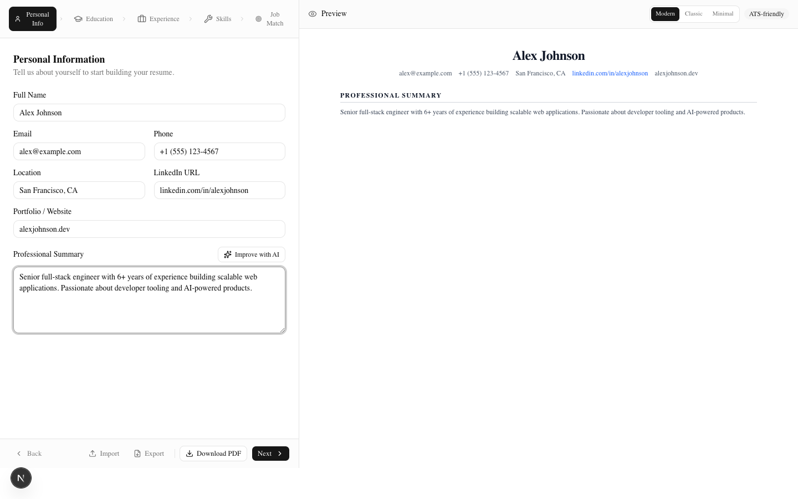
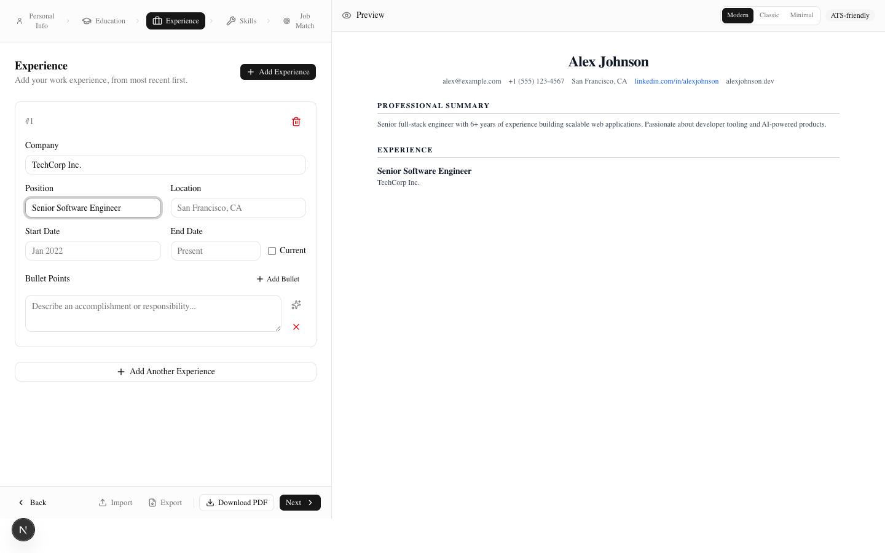
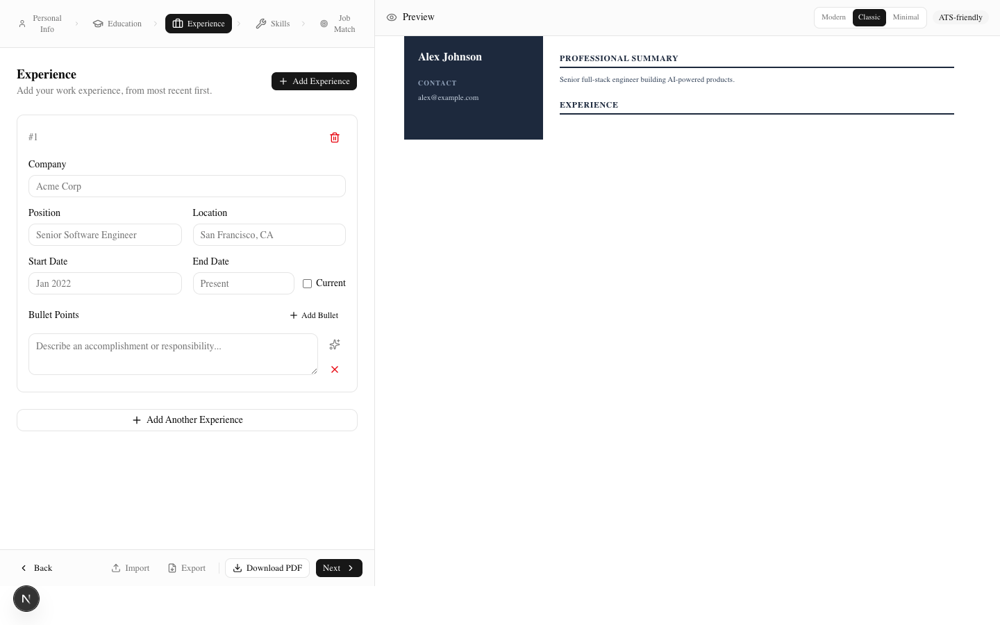
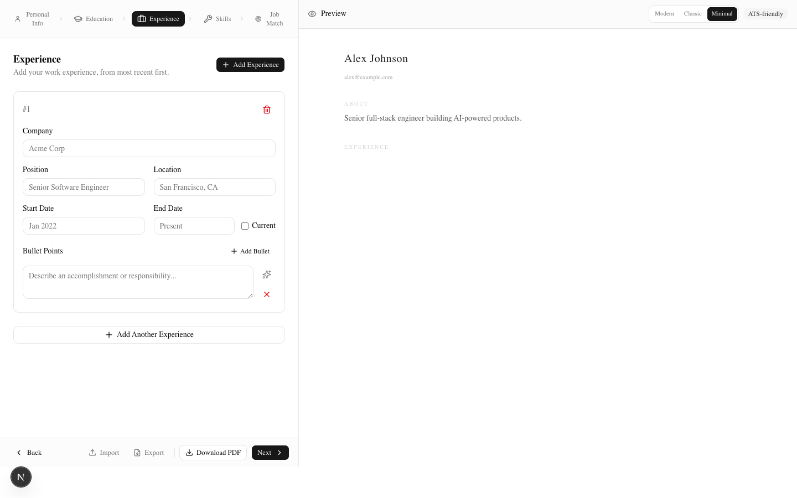
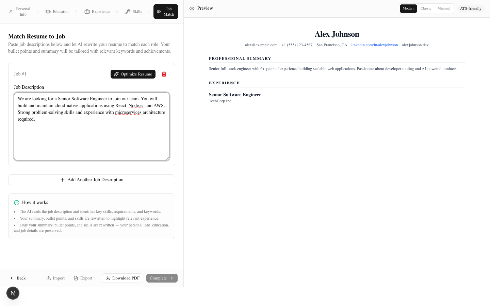

# AI-Powered Resume Builder

> Build polished, ATS-friendly resumes with AI-powered wording suggestions, multiple templates, and job description matching.


---

## Features

### 📝 Multi-Step Resume Builder
A guided 5-step form that walks you through building a complete resume:

| Step | Section | Details |
|------|---------|---------|
| 1 | **Personal Info** | Name, email, phone, location, LinkedIn, website, professional summary |
| 2 | **Education** | Institution, degree, field of study, dates, GPA, description |
| 3 | **Experience** | Company, position, location, dates, bullet points with AI improvement |
| 4 | **Skills** | Skill name, category, proficiency level + AI skill suggestions |
| 5 | **Job Match** | Paste job descriptions and optimize your resume for each role |

<p align="center">
  
  <br />
  <em>The personal info step with AI-powered summary improvement</em>
</p>

### 🤖 AI-Powered Features
- **Improve Summary** — Rewrites your professional summary to be more impactful and ATS-friendly
- **Improve Bullet Points** — Transforms each bullet point with strong action verbs and quantified achievements
- **Suggest Skills** — Generates relevant skills from a role or technology description
- **Optimize for Job** — Rewrites your entire resume (summary, bullet points, skills) to match a specific job description

<p align="center">
  
  <br />
  <em>The experience step with AI-powered bullet point optimization</em>
</p>

### 🎨 Multiple Resume Templates
Switch between three professionally designed templates in the live preview — each with a matching PDF style:

<p align="center">
  
  <br />
  <em>Classic template — two-column layout with dark sidebar</em>
</p>

<p align="center">
  
  <br />
  <em>Minimal template — ultra-clean typography with light colors</em>
</p>

### 📄 PDF Generation
Server-side PDF generation using `@react-pdf/renderer` — each template has a matching PDF style. Download your resume as a clean, text-based PDF file.

### 🔍 Job Description Matching
Paste a job description and let AI rewrite your resume to match the role. Your summary, bullet points, and skills are tailored with relevant keywords while preserving your personal info and experience details.

<p align="center">
  
  <br />
  <em>The job match step — paste a JD and optimize your resume</em>
</p>

### 💾 Data Portability
- **Export JSON** — Download your resume data as a JSON file for backup
- **Import JSON** — Upload a previously exported JSON file to restore your data
- Templates, job descriptions, and all form data are included in exports

---

## Tech Stack

| Layer | Technology |
|-------|-----------|
| **Framework** | [Next.js 16](https://nextjs.org/) (App Router) |
| **Language** | [TypeScript](https://www.typescriptlang.org/) |
| **Styling** | [Tailwind CSS v4](https://tailwindcss.com/) + [shadcn/ui](https://ui.shadcn.com/) |
| **AI** | [Vercel AI SDK v7](https://sdk.vercel.ai/) + Google Gemini 2.0 Flash |
| **PDF** | [@react-pdf/renderer](https://react-pdf.org/) (server-side) |
| **Icons** | [Lucide](https://lucide.dev/) |
| **Notifications** | [Sonner](https://sonner.emilkowal.ski/) |
| **Testing** | [Vitest](https://vitest.dev/) + [Testing Library](https://testing-library.com/) |
| **Deployment** | [Vercel](https://vercel.com/) |

---

## Getting Started

### Prerequisites
- Node.js 18+ and npm
- A [Google Gemini API key](https://aistudio.google.com/apikey) (free tier available)

### Local Development

```bash
# Clone the repository
git clone https://github.com/venom20021/AI_Resume_Generator.git
cd AI_Resume_Generator

# Install dependencies
npm install

# Set up environment variables
cp .env.example .env.local
# Edit .env.local and add your GOOGLE_GENERATIVE_AI_API_KEY

# Start the development server
npm run dev
```

Open [http://localhost:3000](http://localhost:3000) in your browser.

### Scripts

| Command | Description |
|---------|-------------|
| `npm run dev` | Start development server |
| `npm run build` | Build for production |
| `npm run start` | Start production server |
| `npm run lint` | Run ESLint |
| `npm run typecheck` | Run TypeScript type checking |
| `npm run test` | Run test suite (58 tests) |

---

## Project Structure

```
src/
├── app/
│   ├── api/
│   │   ├── generate/route.ts        # AI generation endpoint
│   │   └── generate-pdf/route.tsx   # PDF generation endpoint
│   ├── globals.css                   # Tailwind CSS + shadcn/ui styles
│   ├── layout.tsx                    # Root layout
│   └── page.tsx                      # Home page
├── components/
│   ├── steps/
│   │   ├── personal-info-step.tsx    # Personal info form
│   │   ├── education-step.tsx        # Education form
│   │   ├── experience-step.tsx       # Experience form
│   │   ├── skills-step.tsx           # Skills form
│   │   └── optimize-step.tsx         # Job description matching
│   ├── templates/
│   │   ├── modern-template.tsx       # Modern resume template
│   │   ├── classic-template.tsx      # Classic two-column template
│   │   └── minimal-template.tsx      # Minimal template
│   ├── ui/                           # shadcn/ui components
│   ├── resume-builder.tsx            # Main builder layout
│   └── resume-preview.tsx            # Live preview wrapper
├── lib/
│   ├── types.ts                      # TypeScript types & helpers
│   ├── resume-context.tsx            # React context for state
│   └── validation.ts                 # Form validation logic
└── test/
    └── setup.ts                      # Vitest setup
```

---

## Deployment

### Deploy to Vercel

The project is pre-configured for Vercel deployment with optimized serverless function settings:

1. **Push to GitHub** (already done):
   ```bash
   git remote add origin https://github.com/venom20021/AI_Resume_Generator.git
   git push -u origin main
   ```

2. **Connect to Vercel**:
   - Go to [vercel.com/new](https://vercel.com/new)
   - Import the `AI_Resume_Generator` repository
   - Vercel will auto-detect Next.js and apply the settings from `vercel.json`

3. **Set environment variables**:
   - In Vercel Project Settings → Environment Variables
   - Add `GOOGLE_GENERATIVE_AI_API_KEY` with your Google Gemini API key

4. **Deploy**: Vercel will build and deploy automatically on each push

### Serverless Function Configuration

The `vercel.json` file configures:

| Route | Memory | Timeout | Runtime |
|-------|--------|---------|---------|
| `/api/generate-pdf` | 512 MB | 30s | Node.js |
| `/api/generate` | 256 MB | 30s | Node.js |

The PDF generation route uses the Node.js runtime (not Edge) because `@react-pdf/renderer` requires `Buffer` and Node.js APIs.

---

## Testing

```bash
# Run all tests
npm test

# Run tests in watch mode
npx vitest
```

The test suite covers:
- **Types** — `createEmptyResumeData()` shape and reference isolation, `generateId()` uniqueness
- **Validation** — Personal info, education, experience, and skills validation with edge cases
- **Context** — All CRUD operations, import/export, step navigation, template selection, error boundary

---

## API Routes

### `POST /api/generate`
AI-powered content generation. Accepts a `type` field:
- `summary` — Improve professional summary
- `bullet` — Improve a single bullet point
- `skills` — Suggest skills from a description
- `optimize` — Full resume rewrite for a job description

### `POST /api/generate-pdf`
Generates a PDF resume using `@react-pdf/renderer`. Accepts full resume data and an optional `template` field.

---

## License

[MIT](LICENSE)
